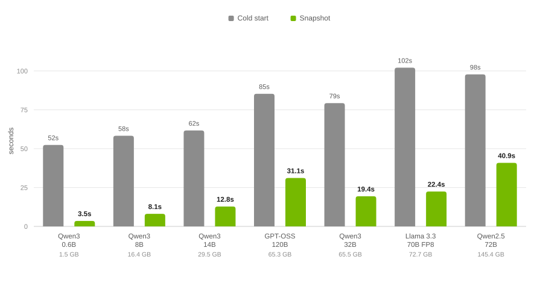
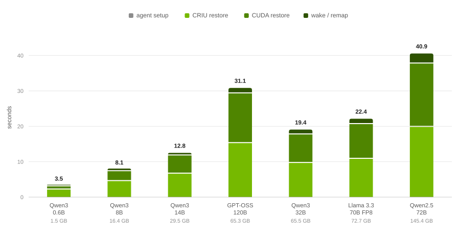

# Performance Benchmarks

Snapshot captures a fully initialized GPU workload and restores it later on the same node or a different one. These benchmarks show how long that restore takes across several model configurations ranging from 1.5 GB to 145.4 GB of model weights and break the time down into the stages that produce it. We cover the restore path only and we show that the time a restore takes is governed almost entirely by how many bytes have to move, that Snapshot's own coordination cost stays flat at around 10 milliseconds regardless of workload size.

## Introduction

A GPU inference workload takes minutes to become ready, and every new replica pays that cost again. When traffic spikes, the usual workaround is to keep idle replicas running, which means paying for GPUs that serve nothing.

Snapshot captures one fully initialized workload and restores copies of it instead. Refer to [The Solution](../../README.md#the-solution) section to understand the mechanism. That first slow start can additionally be sped up with [Run:ai Model Streamer](https://github.com/run-ai/runai-model-streamer).

This document answers the practical question: how long does a restore actually take, and what governs it.

## Benchmarking Setup

The runs used single GPU LLM serving workloads, with the KV cache discarded before capture so that it is not part of the artifact.

| Property | Value |
|---|---|
| Workload type | Single GPU LLM inference server |
| Models | 1.5 GB to 145.4 GB of weights |
| KV cache handling | Discarded before capture |
| Inference engine | vLLM 0.20 |
| GPU | NVIDIA B200 |
| NVIDIA driver | 595 |
| Storage backend | VAST PVC |
| Restore locality | Not pinned. Placement was left to the scheduler, so restores were neither forced onto the capture node nor forced away from it. |

The Weights column is the size of each model's safetensors files on the Hugging Face Hub at the checkpoint's native precision. Weight size is not the same thing as artifact size, since a snapshot artifact also contains the CUDA context, compiled kernels, and workspace buffers.

### Snapshot Measurements

The clock starts when Snapshot is instructed to restore and stops when the workload is running again.

The measurements deliberately exclude container image pull and container startup. Those happen before Snapshot is involved and vary widely between clusters. This matches how restore time was reported in the [Dynamo Snapshot blog post](https://developer.nvidia.com/blog/nvidia-dynamo-snapshot-fast-startup-for-inference-workloads-on-kubernetes/).

A GPU workload restore includes four stages. We report each one separately, along with the total:

| Stage | What happens | What it means in inference setup |
|---|---|---|
| **agent setup** | The node agent locates the snapshot artifact, identifies the target container, works out which physical GPU on this machine to use, and prepares the filesystem mappings. Preparation only, no data is moved yet. | Nothing yet. This is the moment before the inference engine would begin loading the model. No weights are read and no CUDA work has started. |
| **CRIU restore** | CRIU reads the saved process image from storage and rebuilds everything on the CPU side: the program's memory, its threads, its open files and sockets. This is a large read from storage into host RAM, so its speed is set by the storage backend. | Reading safetensors from disk into host RAM. It also brings back everything a cold start would have to construct from scratch: compiled kernels, captured CUDA graphs, the tokenizer, the scheduler, and the engine's own objects. None of that is rebuilt. |
| **CUDA restore** | cuda-checkpoint copies the GPU side state out of host memory and back onto the GPU: CUDA contexts, streams, and device allocations. Its speed is set by the PCIe link between CPU and GPU. | Creating the CUDA context, moving weights onto the device, autotuning kernels, sizing the KV cache pool, and capturing CUDA graphs. For large models, this causes most of the wait time. The process is just a bulk copy of the final state, bypassing any need to compile, autotune, or profile. |
| **wake / remap** | The revived process still holds the network address and GPU identifier of the machine it was frozen on. This stage rewrites the pod IP through the inet-remap CRIU plugin, maps the saved GPU UUID onto the device present on this node, and signals the workload that it is awake. | The engine's resume hook: the KV cache pool is mapped back, weight buffers return to the device, and the workload announces itself so the router can send traffic to it. This is the last readiness step before a server accepts requests. |
| **end to end** | The four stages above, plus around 10 milliseconds of sequencing between them. This is the figure a user experiences. | Engine initialization, weight load, and warm up combined. Add your container start time to get the full pod readiness figure. |

### Cold Start Measurements

**Cold start** is the same workload starting from scratch on the same hardware and the same stack.

That experiment measured container startup as its own stage, between 4.8 and 5.7 seconds depending
on the model, and we have subtracted it from the Cold start column in the results below. The restore
measurements begin once the container is already running, because CRIU injects the restored process
into a container that has already started, so container startup never appears in them. It is a cost
both paths pay, so removing it from both keeps the comparison fair. With it included, the full cold
start totals ranged from 58.0 to 106.9 seconds.

## Results

All timings are in seconds. Rows are ordered by weight size.

### Cold start compared with Snapshot

| Model | Weights | Cold start | Snapshot |
|---|---:|---:|---:|
| Qwen3 0.6B | 1.5 GB | 52.4 | 3.506 |
| Qwen3 8B | 16.4 GB | 58.3 | 8.071 |
| Qwen3 14B | 29.5 GB | 61.7 | 12.790 |
| GPT-OSS 120B | 65.3 GB | 85.3 | 31.135 |
| Qwen3 32B | 65.5 GB | 79.3 | 19.379 |
| Llama 3.3 70B FP8 | 72.7 GB | 102.1 | 22.439 |
| Qwen2.5 72B | 145.4 GB | 97.8 | 40.867 |

&nbsp;

  <picture>
    <source media="(prefers-color-scheme: dark)" srcset="img/cold-start-vs-snapshot-dark.svg">
    <source media="(prefers-color-scheme: light)" srcset="img/cold-start-vs-snapshot-light.svg">
    
  </picture>

<i><b>Figure 1.</b> Cold start compared with Snapshot. One pair per model configuration, ordered by weight size.</i>

&nbsp;

### Where the restore time goes

The four stages of a restore, and their sum. The Total column is the same figure as the Snapshot
column above.

| Model | agent setup | CRIU restore | CUDA restore | wake / remap | Total |
|---|---:|---:|---:|---:|---:|
| Qwen3 0.6B | 0.075 | 2.359 | 0.894 | 0.165 | 3.506 |
| Qwen3 8B | 0.080 | 4.733 | 2.795 | 0.450 | 8.071 |
| Qwen3 14B | 0.076 | 6.834 | 5.145 | 0.722 | 12.790 |
| GPT-OSS 120B | 0.072 | 15.465 | 14.054 | 1.530 | 31.135 |
| Qwen3 32B | 0.078 | 9.854 | 8.059 | 1.376 | 19.379 |
| Llama 3.3 70B FP8 | 0.069 | 11.033 | 9.809 | 1.516 | 22.439 |
| Qwen2.5 72B | 0.084 | 20.039 | 17.898 | 2.832 | 40.867 |

&nbsp;

  <picture>
    <source media="(prefers-color-scheme: dark)" srcset="img/restore-stages-dark.svg">
    <source media="(prefers-color-scheme: light)" srcset="img/restore-stages-light.svg">
    
  </picture>

<i><b>Figure 2.</b> Restore time by stage. The same Snapshot totals, split into the stages that produce them. The number above each column is the end to end time in seconds.</i>

&nbsp;

## Discussion & Learnings

### Checkpoint size is what predicts restore time

Llama 3.3 70B FP8 and Qwen2.5 72B have effectively the same parameter count. FP8 halves the bytes, and the restore time roughly halves with it: 22.4 seconds against 40.9 seconds. GPT-OSS 120B is nominally the largest model in the sweep, but MXFP4 quantization and MoE sparsity put its weights at 65.3 GB, less than half those of Qwen2.5 72B, and it restores faster, at 31.1 seconds.

Quantization, parameter count, and other factors combine to determine the size of the checkpoint, and checkpoint size is what ultimately predicts restore time. When estimating for your own workload, start from how many gigabytes it holds on the GPU rather than from its parameter count.

### Storage throughput sets the floor

CRIU restore is a bulk read of the checkpoint from shared storage into host RAM, and it is the single largest stage in every configuration measured here, between 49 and 67 percent of end to end time. The storage backend therefore largely determines how fast a restore can be.

Every number in this document was measured with the checkpoint on a VAST PVC. A slower backend moves every row up, and a faster one moves every row down, so these results should be read as specific to that setup rather than as a property of Snapshot itself.